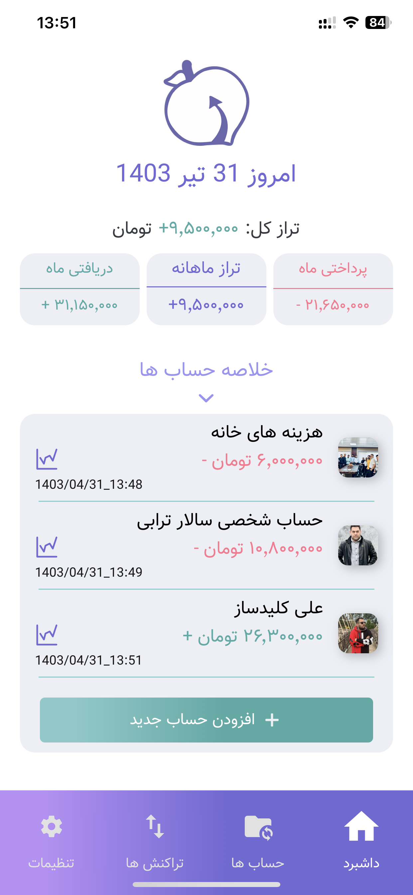
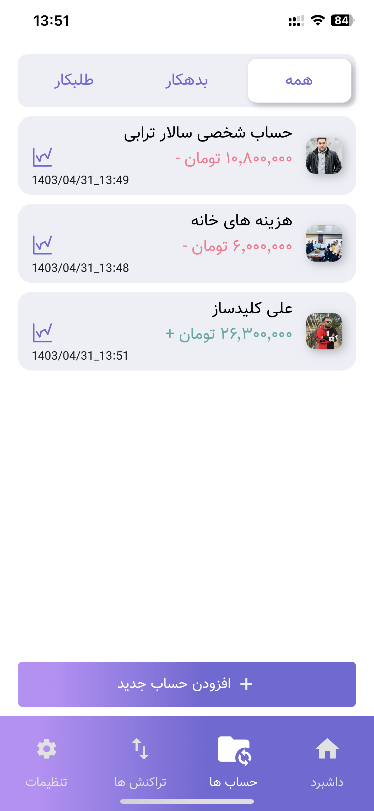
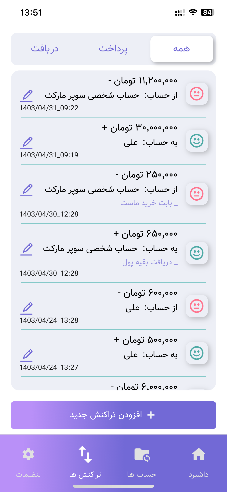
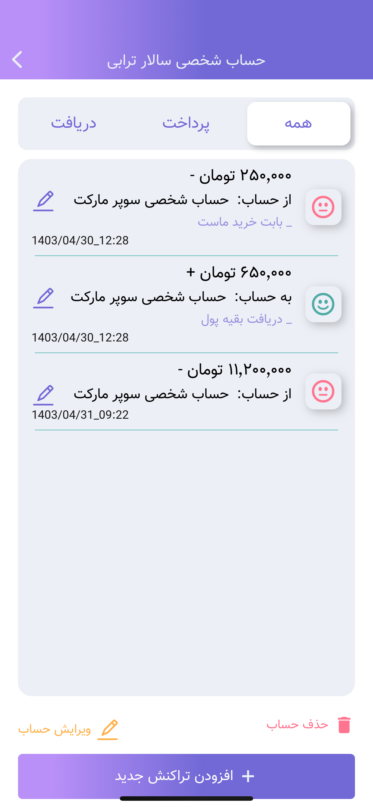

# Shalil application Developed by React Native & Expo
<p align="center">
  
  
  
  
</p>


## Application summery
This project developed by *React Native* @0.74.2 & *Expo* @51.0.11 *Typescript* @5.3.3 & @Redux toolkit* @2.2.5  basically.
This is an open-source project and you can take part for the new versions!


### Component folder
This folder provides components to use globally

### Store folder
This folder provides Context Api used for managing states inside application

### enums folder
This folder provides required enums for typescript usage

### Interface folder
This folder provides typescript interfaces needed by other components. (since using typescript!)

### Features folder
This folder provides common functions will be used from other components

### Screens folder
Provides routes to the application

### assets folder
This folder provides Media (contains Images, fonts, videos, language_files ...) using in the application.


### local run
First, install necessary packages:
```bash
npm instal

Then, run the development server (you can see changes online):
```bash
npm run start

# You need an emulator (e.g. Android Studio) or a simulator (e.g. X-code simulator) or you can install *Expo go* application on your phone and run the server:
